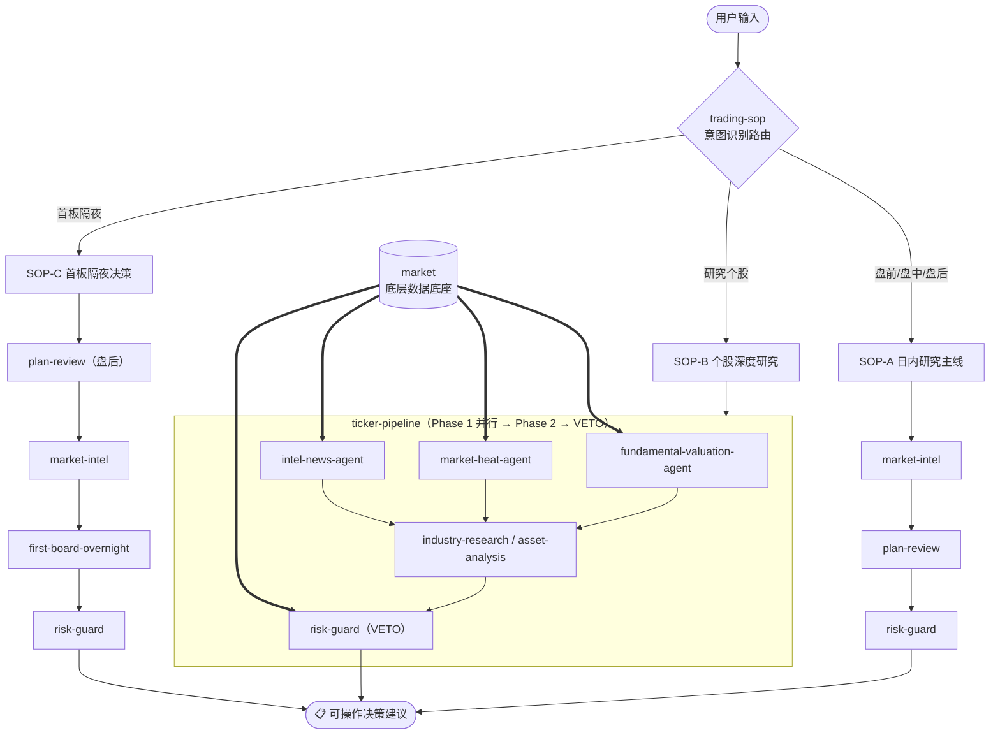

# mmtickerlab

面向二级市场（A股/港美股）投研、量化分析与模拟交易的通用 Agent 技能库，适用于 Claude Code、OpenClaw 等多种智能体环境。

**⚠️ 重要提示**：这是一个**完整的技能包矩阵（Skill Suite）**。各个技能之间存在深度的逻辑流转与底层数据（如 market 技能提供的行情底座）依赖。为了获得完整的投研决策流水线和可视化看板体验，**强烈建议将本仓库内的所有技能全部安装并配合使用**。

---

## 技能一览 (Skills)

仓库内包含 10 个标准化独立技能，各技能定位与入口说明如下：

| 层次 | 技能名称 (Slug) | 核心功能与职能 |
|:---|:---|:---|
| **🗂️ SOP 总编排** | [`trading-sop`](trading-sop/SKILL.md) | 所有投研与决策技能的入口调度层。识别用户意图（盘前/盘中/盘后/个股深研/首板隔夜），路由至对应 SOP 链，编排调用现有技能，汇总输出最终可操作建议。是日常交易流程的统一起点。 |
| **并行流水线** | [`ticker-pipeline`](ticker-pipeline/SKILL.md) | 多 Agent 并行投研与风控决策流水线。输入标的代码与日期，并发调度多个专业 Subagent 全面透视基本面 EPS 与多模型市值、筹码资金与机构热度、全网消息舆情，结合大势环境进行量化风控核验（一票否决门禁），最终交付综合决策研报。各专员 Prompt 独立存放于 `agents/`，底层数据直接调用 `market` 技能，数据缺失时严格终止阻断。 |
| **底层数据** | [`market`](market/SKILL.md) | A股/港美股行情、K线、20+ 项确定性技术指标、资金流、涨跌停、龙虎榜与财务数据。优先使用问财，AKShare 仅作 A 股兜底。 |
| **步骤 1：事实** | [`market-intel`](market-intel/SKILL.md) | 市场情报与资讯扫描 SOP。覆盖宏观政策、隔夜外盘、板块资金流向及盘中大单，输出客观《市场情报快报》。只报事实，不给建议。 |
| **步骤 2：研报** | [`asset-analysis`](asset-analysis/SKILL.md) | 标的量化投研 SOP（支持 A/港/美）。提取基本面真实 EPS，提供 PE/PEG/PB-ROE/PS/DCF 多模型目标市值测算及四维技术量化解析。 |
| **步骤 3：门禁** | [`risk-guard`](risk-guard/SKILL.md) | 量化信号校验与风控门禁 SOP。结合大势乘数校准自洽性，计算全仓与单标的仓位上限、动态止损线，行使**一票否决权（Veto Authority）**。 |
| **宏观深度** | [`industry-research`](industry-research/SKILL.md) | 深度行业与产业链透视 SOP。五维透视产业链全景与价值链分配、生命周期与供需拐点、龙头对比矩阵及二级市场真实标的与 ETF 映射。 |
| **垂直策略** | [`first-board-overnight`](first-board-overnight/SKILL.md) | A 股首板隔夜决策专用交易策略。基于可审计数据评估首板赚钱效应与梯队，输出 BUY/WATCH/NO_TRADE 决策与 T+1 退出计划。 |
| **执行审计** | [`sim-trade`](sim-trade/SKILL.md) | A 股实盘级模拟交易撮合引擎。带严格数据完整性门禁、限价委托、五档盘口真实撮合、T+1 规则与 SQLite 可审计流水账本。 |
| **流程闭环** | [`plan-review`](plan-review/SKILL.md) | 基于已校验快照生成盘前计划、午间复盘和收盘复盘的三段式操作系统。数据不完整时立即阻断，不创建报告。 |

---

## 安装使用 (Installation)

### 方式一：通过 ClawHub 一键安装（推荐）

全套技能已发布至 [ClawHub 官方注册表](https://clawhub.ai/fize)。在 OpenClaw / Claude Code 等支持 Agent Skills 的环境中，可直接通过 CLI 一键安装：

```bash
# 强烈推荐：一键安装全套 10 个技能包（构建完整投研量化闭环）
clawhub install @fize/trading-sop @fize/market @fize/ticker-pipeline @fize/asset-analysis @fize/risk-guard @fize/market-intel @fize/industry-research @fize/first-board-overnight @fize/plan-review @fize/sim-trade

# 或根据需要单独安装指定技能：
clawhub install @fize/trading-sop        # SOP 总调度入口与投研看板
clawhub install @fize/market             # A 股/港美股行情与财务数据底座
clawhub install @fize/sim-trade          # A 股确定性模拟交易引擎
```

### 方式二：通过 Git 源码加载

直接克隆本仓库到项目的 `skills/` 目录或智能体全局技能目录（如 `~/.openclaw/skills/`）：

```bash
git clone https://github.com/Fize/mmtickerlab.git
```

---

## 投研与交易工作流（Pipeline）

日常使用以 `trading-sop` 为统一入口，根据意图自动路由至对应链路；各技能亦可独立按需触发：



---

## 投研看板与 HTTP 服务 (Dashboard)

各技能输出的标准化报告均归档至 `report/` 目录（涵盖 `daily/` 日内复盘、`ticker/` 个股决策总报、`strategy/` 策略决策、`industry/` 行业研报、`sop/` 执行摘要）。内置轻量 HTTP 服务可一键开启可视化交互看板，并直连 `market` 数据底座提供动态 K 线与均线/成交量/MACD/RSI 交互指标图表：

```bash
# 启动投研看板（默认端口 19876，纯标准库，零外部依赖）
python3 trading-sop/scripts/server.py

# 浏览器访问：http://127.0.0.1:19876
```

---

## 核心系统约束与设计原则（System Rules）

1. **数据确定性与完整性保障（Data Integrity & Determinism）**：
   - 坚持数据真实性与可复现性，量化指标与财务估值严格基于真实行情与财报基数；
   - 具备多级数据校验与自动兜底机制，关键数据缺失时触发 Fail-Fast 安全阻断，确保投研分析与交易回测的严谨性与审计合规。
2. **AKShare 仅限 A 股兜底**：
   - 港美股标的数据严格经由同花顺问财获取；若未配置问财 API Key 或接口异常，立即安全阻断，不跨市场兜底。
3. **模拟交易（`sim-trade`）A 股专用**：
   - 严格执行沪深京 A 股 6 位代码校验、T+1 交割制度与五档盘口真实撮合，输入港美股代码直接拒单。
4. **复盘数据不可回填**：
   - 全市场快照必须在规定时间窗口（午间 11:30-13:00，收盘 15:05 后）原子采集，禁止用后验数据回填历史截面。

---

## 开源协议 (License)

本项目遵循 [MIT License](LICENSE) 开源协议。
