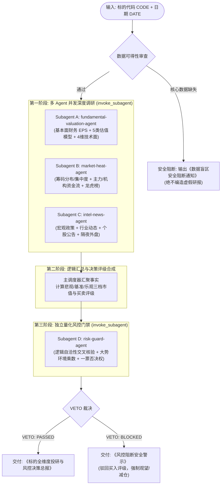

# Pipeline — 多 Agent 并行投研与风控决策流水线

本技能作为端到端的多智能体协同投研操作系统。通过并发调度多个专业 Subagent，实现从底层事实采集、基本面估值核算、筹码与机构热度透视、全网消息舆情扫描，到跨维度综合评级，最后经由独立量化风控门禁行使一票否决权（VETO Authority），输出高置信度的决策总报。

---

## 零虚构与无数据坚决不输出研报铁律（Zero-Fabrication Data Gate）

1. **真实数据绝对唯一性**：
   - 流水线中引用的所有基本面财务数据（最新 EPS、归母净利润、营收增速、净资产）、行情与技术指标（最新价、涨跌幅、均线、MACD、RSI、布林带）、筹码数据（获利盘比例、平均成本、集中度）、机构资金流（1/3/5日净流入、主力净买额、龙虎榜席位）以及宏观/外盘资讯，**必须 100% 为确定性真实数据**。
2. **多级权威数据获取路径**：
   - **第一优先**：调用本仓库 `market/.venv/bin/python market/scripts/market_data.py` 对应子命令获取确定性数据；
   - **第二优先**：若命令遇到网络波动、港美股特定财报字段未包含或问财受限，必须通过 `search_web` / `read_url_content` / `tencent-news` / `agent-browser` 检索官方公告、交易所数据（上交所/深交所/港交所/SEC）或权威财经媒体（新华财经、彭博、路透、东方财富）。
3. **缺失即阻断（Fail-Fast）**：
   - 若通过上述所有途径均无法获取到标的的核心真实财务（EPS/净利润）或行情数据，**流水线必须立即无条件安全终止**；
   - 直接向用户输出《数据盲区安全阻断通知》，**坚决严禁编造任何虚假财务数字、脑补技术指标或输出毫无数据支撑的虚构研报**！

---

## 流水线整体架构



---

## 阶段一：多 Agent 并行深度调研

主调度器必须使用单次 `invoke_subagent` 调用，同时启动 3 个专属 Subagent 进行并发分析，避免串行等待。

### 并发调度指令规范

```python
invoke_subagent(
    Subagents=[
        {
            "TypeName": "self",
            "Role": "fundamental-valuation-agent",
            "Prompt": "<Subagent A 提示词，填入具体 CODE 与 DATE>"
        },
        {
            "TypeName": "self",
            "Role": "market-heat-agent",
            "Prompt": "<Subagent B 提示词，填入具体 CODE 与 DATE>"
        },
        {
            "TypeName": "self",
            "Role": "intel-news-agent",
            "Prompt": "<Subagent C 提示词，填入具体 CODE 与 DATE>"
        }
    ]
)
```

---

### Subagent A: 基本面与多模型估值专员 (`fundamental-valuation-agent`)

#### 1. 角色职责与目标
透视标的真实资产质地、盈利质量与成长性。核算真实 EPS，根据公司商业模式从 5 种估值模型（PE / PEG / PB-ROE / PS / 自由现金流折现 DCF）中选取 2~3 种最适用模型，测算【悲观 / 基准 / 乐观】三档目标市值与对应目标价，并结合 20+ 项量化技术指标进行技术面体检。

#### 2. 确定性执行指令
```bash
# 1. 基础行情与最新市值
market/.venv/bin/python market/scripts/market_data.py quote --date {DATE} --code {CODE}

# 2. 真实财务三大表（利润表、资产负债表、现金流量表）
market/.venv/bin/python market/scripts/market_data.py financials --date {DATE} --code {CODE} --statement income --count 4
market/.venv/bin/python market/scripts/market_data.py financials --date {DATE} --code {CODE} --statement balance_sheet --count 4
market/.venv/bin/python market/scripts/market_data.py financials --date {DATE} --code {CODE} --statement cashflow --count 4

# 3. 确定性量化技术指标（20+ 项，均线、MACD、RSI、ATR、布林带）
market/.venv/bin/python market/scripts/market_data.py technical --date {DATE} --code {CODE} --count 10 --adjust qfq
```

#### 3. 多模型估值计算规则
- **模型 1：PE 估值（成熟盈利型企业）**
  - 公式：目标市值 = 预期归母净利润（或 TTM 净利润） × 目标 PE
  - 悲观（行业下限分位 PE）/ 基准（历史中枢 PE）/ 乐观（行业景气分位 PE）。
- **模型 2：PEG 估值（高成长型企业）**
  - 公式：合理 PE = 预期归母净利润复合增速 G (%) × 目标 PEG (基准取 1.0，悲观 0.8，乐观 1.2)；目标市值 = 归母净利润 × 合理 PE。
- **模型 3：PB-ROE 估值（重资产/周期/金融类企业）**
  - 公式：目标 PB = 预期稳定 ROE (%) / 股权资本成本 COE (通常取 8%~10%)；目标市值 = 归母净资产 × 目标 PB。
- **模型 4：PS 估值（高研发/亏损期/平台型企业）**
  - 公式：目标市值 = 营业收入 × 目标 PS (基准取行业中位数 PS)。
- **模型 5：极简 DCF 估值（现金流稳定白马企业）**
  - 公式：对未来 3 年自由现金流（经营活动现金流净额 - 资本开支）按折现率 WACC (8%~10%) 进行折现，终值按永续增长率 g (1%~2.5%) 测算。

#### 4. 专员 Prompt 模板
```text
你现在是流水线专员「基本面与多模型估值专员」(fundamental-valuation-agent)。
任务：深度调研标的 {CODE} 在日期 {DATE} 的基本面质地与量化技术面。

执行步骤：
1. 运行 quote、financials (income, balance_sheet, cashflow)、technical 真实数据命令。
2. 提炼真实 EPS (扣非前与扣非后)、营业收入同比增速、归母净利润同比增速、最新净资产收益率 (ROE)、资产负债率。
3. 若命令无法返回数据，通过 search_web/read_url_content 检索交易所官方财报。若完全无数据，立即报告数据缺失，不可捏造！
4. 匹配企业生命周期与商业模式，选取 2~3 个最适配的估值模型，严格按照公式计算【悲观 / 基准 / 乐观】三档目标市值与对应目标价。
5. 梳理量化技术面：均线排列（MA5/10/20/60/120/250）、MACD 零轴与红绿柱状态、RSI_6/14、布林带带宽与价格通道位置。

最终输出 JSON 格式事实块：
{
  "code": "{CODE}",
  "quote": {"close": float, "pct_chg": float, "turnover_rate": float, "pe_ttm": float, "pb": float, "total_mv": float},
  "financials": {"eps": float, "revenue_yoy": float, "profit_yoy": float, "roe": float, "debt_ratio": float},
  "valuation_models": {
    "models_used": ["PE", "PEG"],
    "scenarios": {
      "downside": {"target_mv": float, "target_price": float, "assumption": str},
      "base": {"target_mv": float, "target_price": float, "assumption": str},
      "upside": {"target_mv": float, "target_price": float, "assumption": str}
    }
  },
  "technical_summary": {"ma_trend": str, "macd_status": str, "rsi_6": float, "boll_position": str, "support": float, "resistance": float}
}
```

---

### Subagent B: 市场热度与机构参与度专员 (`market-heat-agent`)

#### 1. 角色职责与目标
深度透视筹码成本结构、主力资金进出与机构博弈深度。评估当前获利盘比重、筹码单峰/多峰密集度、主力资金 1/3/5 日持续性净买卖力度，以及龙虎榜（LHB）游资与机构席位动向。

#### 2. 确定性执行指令
```bash
# 1. 筹码分布（获利比例、平均持仓成本、70%与90%筹码集中度）
market/.venv/bin/python market/scripts/market_data.py chips --date {DATE} --code {CODE} --count 10

# 2. 个股多周期资金流向（1日、3日、5日超大单/大单/中单/小单净流入与净占比）
market/.venv/bin/python market/scripts/market_data.py stock-flow --date {DATE} --code {CODE} --flow-period 5

# 3. 龙虎榜异动席位（买卖前五席位、机构专用席位净额）
market/.venv/bin/python market/scripts/market_data.py lhb --date {DATE} --code {CODE}
```

#### 3. 专员 Prompt 模板
```text
你现在是流水线专员「市场热度与机构参与度专员」(market-heat-agent)。
任务：深度透视标的 {CODE} 在日期 {DATE} 的筹码结构、机构资金流向与交易热度。

执行步骤：
1. 运行 chips、stock-flow、lhb 真实数据命令。
2. 筹码面分析：提取最新 profit_ratio (获利盘比例)、avg_cost (平均持股成本)、concentration_70 (70%集中度)、concentration_90 (90%集中度)。分析筹码是高位锁定、单峰密集还是低位发散套牢。
3. 资金面分析：提取 1 日/3 日/5 日主力资金（超大单+大单）净流入金额及成交额占比。判断主力是在吸筹建仓、拉升助推还是暗中派发。
4. 龙虎榜席位：检查是否有龙虎榜上榜记录。提取机构专用席位（Institutions）与知名游资席位买卖净差额。
5. 若数据缺失，使用 search_web 检索同花顺/东方财富个股实时资金与龙虎榜数据。若完全无数据，立即如实报告，不可捏造。

最终输出 JSON 格式事实块：
{
  "code": "{CODE}",
  "chips": {
    "profit_ratio": float,
    "avg_cost": float,
    "concentration_70": float,
    "concentration_90": float,
    "pattern": str
  },
  "fund_flows": {
    "net_inflow_1d": float,
    "net_inflow_3d": float,
    "net_inflow_5d": float,
    "super_large_ratio": float,
    "main_intent": str
  },
  "institution_participation": {
    "has_lhb": bool,
    "institution_net_buy": float,
    "seat_feature": str
  },
  "heat_sentiment": "极度过热 | 资金温和入场 | 震荡换手 | 资金净流出派发"
}
```

---

### Subagent C: 消息舆情与市场情报专员 (`intel-news-agent`)

#### 1. 角色职责与目标
全天候扫描宏观政策风向、所处行业板块催化、标的公司自身公告（重组、增减持、业绩预告、合同中标、诉讼立案）、全网权威舆情及隔夜外盘联动。客观陈述事实，执行四维属性打标。

#### 2. 确定性执行指令
```bash
# 1. 标的最新新闻与公告原文（近 10 条）
market/.venv/bin/python market/scripts/market_data.py news --date {DATE} --code {CODE} --count 10

# 2. 板块与行业资金流向截面（判断标的所处行业是主线还是冷门）
market/.venv/bin/python market/scripts/market_data.py flows --date {DATE} --session close

# 3. 隔夜外盘与汇率联动（美股三大指数、富时 A50、美元兑人民币）
market/.venv/bin/python market/scripts/market_data.py overnight --date {DATE}
```

#### 3. 专员 Prompt 模板
```text
你现在是流水线专员「消息舆情与市场情报专员」(intel-news-agent)。
任务：全面扫描标的 {CODE} 在日期 {DATE} 的客观消息面、政策催化与公司公告。

执行步骤：
1. 运行 news、flows、overnight 真实数据指令。
2. 补充检索：调用 tencent-news、search_web 检索该标的最新重大事项（交易所关注函、立案调查、高管减持、业绩预警、重大订单合同）。
3. 情报四维打标：
   - 资产与行业归属
   - 影响方向（正面 / 负面 / 中性）
   - 重要级别（🔴高 - 涉及公司生死与大盘开盘 / 🟡中 - 涉及短期财报与订单 / 🔵低 - 常规行业通告）
   - 事实时间戳与信息来源
4. 严禁捏造未经公开披露的小道传闻，严禁添加主观交易建议。

最终输出 JSON 格式事实块：
{
  "code": "{CODE}",
  "overnight_macro": {"us_market_sentiment": str, "a50_chg": float, "fx_trend": str},
  "industry_flow_status": {"sector_name": str, "sector_flow_rank": str, "is_leading_sector": bool},
  "company_events": [
    {
      "date": str,
      "source": str,
      "level": "🔴高 | 🟡中 | 🔵低",
      "direction": "正面 | 负面 | 中性",
      "summary": str
    }
  ],
  "negative_warning_flag": bool,
  "negative_warning_details": str
}
```

---

## 阶段二：评级合成与目标价推导

主调度器汇聚 Subagent A、B、C 的三方客观事实，执行多因子加权评分（0~100 分）：
- **基本面质地与估值差（权重 35%）**：EPS 增长、ROE 水平、当前市值相对基准估值折扣率；
- **筹码结构与资金合力（权重 25%）**：筹码获利盘适中程度（30%~70% 最佳）、主力资金持续流入强度；
- **消息与政策催化度（权重 20%）**：所处赛道景气度、是否存在重大正面催化、排查无一票否决级利空；
- **技术量化趋势配合（权重 20%）**：多头均线排列、量价配合、MACD 处于红柱多头区。

### 综合得分与初始建议评级矩阵

| 综合加权得分 | 初始决策建议 | 评级含义 |
|:---:|:---:|:---|
| **85 ~ 100 分** | 🟢 **强烈推荐买入 (Strong Buy)** | 基本面扎实、估值具备安全边际、资金净流入、政策正向催化 |
| **70 ~ 84 分** | 🟡 **逢低试仓配置 (Buy on Dips)** | 核心逻辑向好，但短期存在技术阻力或筹码松动，宜分批低吸 |
| **50 ~ 69 分** | ⚪ **观望持有 (Hold / Watch)** | 逻辑平淡、估值处于合理区间上沿、无主力明显入场迹象 |
| **0 ~ 49 分** | 🔴 **减仓卖出 (Sell / Reduce)** | 基本面恶化、主力资金大幅撤离、存在重大利空或破位空头 |

---

## 阶段三：独立量化风控核验与一票否决门禁

在生成最终报告前，**必须拉起 Subagent D（量化风控专员 `risk-guard-agent`）**，对评级与分析逻辑进行全方位逆向质疑与自洽性核验，行使一票否决权（VETO Authority）。

### Subagent D: 量化风控与一票否决专员 (`risk-guard-agent`)

#### 1. 角色职责与目标
作为买入前的独立安全门禁。负责大势环境（Regime）标定、信号自洽性交叉核验、仓位上限计算、动态止损位锁定，以及排查 4 大一票否决红线。

#### 2. 确定性执行指令
```bash
# 1. 全市场大势截面与宽度（上涨家数、跌停家数、全市场中位数）
market/.venv/bin/python market/scripts/market_data.py snapshot --date {DATE} --session close

# 2. 涨跌停与连板情绪高度（炸板率、连板梯队高度）
market/.venv/bin/python market/scripts/market_data.py limits --date {DATE} --session close

# 3. 拟交易标的确定性技术指标（查验均线空头排列、超买背离）
market/.venv/bin/python market/scripts/market_data.py technical --date {DATE} --code {CODE} --count 10 --adjust qfq
```

#### 3. 风控自洽性交叉核验规则
- **核验 1（趋势矛盾）**：若评级为买入（🟢/🟡），但量化指标显示 `MA5 < MA10 < MA20` 且 MACD 零轴下方死叉，判定为**严重逻辑矛盾**。
- **核验 2（超买背离）**：若评级为买入，但 RSI_6 > 85 或获利盘比例 > 95% 且成交量急剧萎缩，判定为**流动性耗尽见顶风险**。
- **核验 3（黑天鹅利空）**：若消息面存在财务造假、退市风险警示（*ST）、证监会立案调查，直接触发**合规极刑阻断**。

#### 4. 大势环境（Regime）仓位乘数矩阵

| 市场环境 (Regime) | 判定条件 | 大势风控乘数 | 推荐全仓位上限 | 单标的持仓上限 | 动态止损幅度 |
|---|---|:---:|:---:|:---:|:---:|
| **牛市 / 强趋势** | 全市场上涨家数 > 65%，连板高度 >= 5 | **1.0** | 80% ~ 95% | <= 25% | -7% ~ -8% (或跌破 MA20) |
| **结构性行情** | 局部主线分化，上涨家数 45%~65% | **0.8** | 50% ~ 70% | <= 15% | -5% ~ -6% (或跌破 MA10) |
| **震荡筑底 / 轮动** | 上涨家数 35%~45%，成交量萎缩 | **0.5** | 30% ~ 50% | <= 10% | -4% ~ -5% (或布林下轨) |
| **熊市 / 极度退潮** | 上涨家数 < 35%，跌停 > 30 家，炸板率 > 40% | **0.2** | <= 20% | <= 5% | -3% (极窄止损) |

#### 5. 专员 Prompt 模板
```text
你现在是流水线独立「量化风控专员」(risk-guard-agent)，拥有买入一票否决权（VETO Authority）。
任务：对标的 {CODE} 在日期 {DATE} 的初始评级进行独立风控审查与自洽性核验。

初始提议评级：{PROPOSED_RATING}
基准目标价：{TARGET_PRICE}
基本面与技术面简要结论：{SUMMARY}

执行步骤：
1. 运行 snapshot、limits、technical 真实数据指令。
2. 标定当前大势环境 (Regime：牛市/结构/震荡/熊市)，查表获取仓位上限乘数。
3. 执行信号自洽性核验：对比提议评级与技术指标（均线方向、MACD 零轴、RSI_6）、筹码获利比率。
4. 排查 4 大一票否决红线：
   - 红线 A：看多但均线明确空头排列且跌破关键支撑位；
   - 红线 B：短线极度超买（RSI_6 > 85 且筹码获利比例 > 95%）；
   - 红线 C：重大合规或造假立案风险；
   - 红线 D：全市场处于熊市崩跌/极度退潮期。
5. 做出风控裁决：
   - 若触发任意红线：输出 "VETO: BLOCKED"，详细列出驳回理由，强制将评级调整为 ⚪ 观望持有 或 🔴 减仓卖出，仓位上限设为 0%；
   - 若未触发红线：输出 "VETO: PASSED"，给出核准的最终仓位上限与动态止损触发价位。

最终输出 JSON 格式风控报告：
{
  "veto_decision": "PASSED | BLOCKED",
  "regime": "牛市 | 结构性行情 | 震荡市 | 熊市退潮",
  "approved_rating": "🟢 强烈推荐买入 | 🟡 逢低试仓配置 | ⚪ 观望持有 | 🔴 减仓卖出",
  "max_position_pct": float,
  "dynamic_stop_loss_price": float,
  "inconsistency_found": bool,
  "veto_reasons": ["理由1", "理由2"]
}
```

---

## 阶段四：标准化输出规范

根据风控审查裁决与数据完整性状态，最终交付对应维度的标准化报告。

### 场景 1：风控通过交付《标的全维度投研与风控决策总报》

```markdown
# 《标的全维度投研与风控决策总报》：[标的名称] ([标的代码])

- **评估基准日期**：YYYY-MM-DD
- **最终决策评级**：🟢 强烈推荐买入 / 🟡 逢低试仓配置 / ⚪ 观望持有 / 🔴 减仓卖出
- **风控门禁状态**：🛡️ **VETO: PASSED (风控合规已放行)**
- **建议持仓上限**：不超过账户总资产的 X%
- **动态止损价位**：XX.XX 元 (跌破即刻触发退出保护)

---

## 1. 核心投资逻辑与三档估值区间

| 估值情景 | 估值核心假设与模型 | 测算目标总市值 (亿元) | 对应目标价 (元) | 较现价上涨空间 |
|:---|:---|:---:|:---:|:---:|
| **悲观情景 (Downside)** | 行业下行周期 / PE 底部折价 | XXX | XX.XX | -XX% / +XX% |
| **基准情景 (Base)** | 业绩符合预期 / 历史中枢估值 | XXX | XX.XX | +XX% |
| **乐观情景 (Upside)** | 催化落地 / 景气溢价估值 | XXX | XX.XX | +XX% |

---

## 2. 基本面真实财务与资产质地

- **最新业绩指标**：最新扣非 EPS 为 X.XX 元，营业收入同比增长 XX.X%，归母净利润同比增长 XX.X%。
- **盈利质量与资产结构**：净资产收益率 (ROE) 为 XX.X%，资产负债率为 XX.X%，经营现金流净额 XXX 亿元。
- **商业模式与壁垒评价**：[简述核心竞争壁垒与客户集中度]。

---

## 3. 筹码博弈与机构参与度透视

- **筹码成本分布**：最新全市场获利盘比例为 XX.X%，全市场平均持股成本为 XX.XX 元。70% 筹码集中度为 XX.X%，呈现 [单峰密集/低位发散] 格局。
- **机构资金动向**：近 5 个交易日主力资金净流入 XXX 万元（占总成交额 XX.X%）。超大单净流入趋势为 [持续吸筹 / 高位派发]。
- **龙虎榜与异动席位**：[机构席位与游资席位博弈情况，若无则注明无异动上榜]。

---

## 4. 全网舆情、公告与行业催化客观事实

- **宏观与外盘截面**：[隔夜美股/A50表现及汇率动态]。
- **所处行业景气度**：[行业板块资金流向排名及主线地位]。
- **标的重大事项**：
  - [YYYY-MM-DD] [🔴高/🟡中/🔵低] [正面/负面] [具体事实陈述，注明官方来源]。

---

## 5. 量化技术指标四维体检

- **趋势形态**：MA5/10/20 排列状态，当前价格站稳/跌破关键均线。
- **动量震荡**：MACD DIF=X.XX, DEA=X.XX, 柱状图状态；RSI_6=XX.X (处于中性/超买/超卖区)。
- **通道与波动**：布林带开口方向，当前价格所处通道位置；近 10 日真实波幅 ATR=X.XX 元。

---

## 6. 独立风控审计日志 (Risk Guard Audit)

- **当前大势环境 (Regime)**：[牛市/结构性/震荡/熊市退潮]，大势仓位乘数核准为 X.X。
- **信号自洽性交叉核验**：
  - 主观逻辑与均线/动量是否一致：[✅ 自洽 / ❌ 存在矛盾已修正]
  - 估值空间与安全边际是否达标：[✅ 合格 / ❌ 不足]
- **动态止损与风控纪律**：若收盘价跌破 XX.XX 元或单日回撤超过 X%，无条件执行纪律止损。
```

---

### 场景 2：风控否决交付《风控阻断安全警示》

```markdown
# 🚨《风控阻断安全警示》：[标的名称] ([标的代码])

- **评估基准日期**：YYYY-MM-DD
- **风控门禁状态**：🚫 **VETO: BLOCKED (一票否决门禁已触发)**
- **原始提议评级**：[原评级，如 🟢 强烈推荐买入]
- **强制修正评级**：⚪ **观望持有** 或 🔴 **减仓卖出**
- **建议持仓上限**：**0% (严禁开仓买入)**

---

## 1. 触发风控一票否决核心红线

1. **[红线名称，如：信号严重背离 / 趋势逻辑矛盾]**：
   - 原始分析认为当前处于逢低买入阶段，但量化指令检测到均线呈现坚决空头排列（MA5 < MA10 < MA20），且 MACD 零轴下死叉发散，属于典型的逆势猜底行为。
2. **[红线名称，如：短线极度超买耗尽]**：
   - RSI_6 达到 XX.X（超过 85 极限阈值），筹码获利盘达到 XX.X%，成交量急剧萎缩出现量价背离，追高盈亏比严重失衡。
3. **[红线名称，如：大势极度恶劣]**：
   - 全市场处于熊市极端退潮期，全市场上涨家数不足 20%，系统性系统风险高企。

---

## 2. 纪律性操作指令
- 立即终止买入操作；
- 已有持仓者应遵照动态止损线 [XX.XX 元] 做好防守准备；
- 保持空仓观望，等待量化指标修复与风控放行信号。
```

---

### 场景 3：关键数据缺失交付《数据盲区安全阻断通知》

```markdown
# ⚠️【数据盲区安全阻断通知】

- **标的代码**：[标的代码]
- **查询日期**：YYYY-MM-DD
- **阻断状态**：🛑 **PIPELINE SAFE HALTED (流水线完全终止)**

---

## 阻断原因说明
流水线在第一阶段数据采集过程中，尝试通过以下全部权威渠道均无法获取到标的的核心真实数据：
1. 本地数据引擎：`market_data.py financials` / `quote` 命令未返回有效财报或行情数值；
2. 权威网络检索：官方交易所公告与主流财经终端未检索到经过审计的最新关键 EPS/营收数据。

---

## 零虚构合规声明
> **MMTickerLab 恪守零虚构铁律（Zero-Fabrication Data Gate）**：
> 拒绝在数据盲区做任何主观臆测，坚决严禁凭空捏造财务数字、技术指标或伪造估值报告。本流水线已安全终止，不生成任何虚假研报以捍卫投研决策的严肃性。
```
