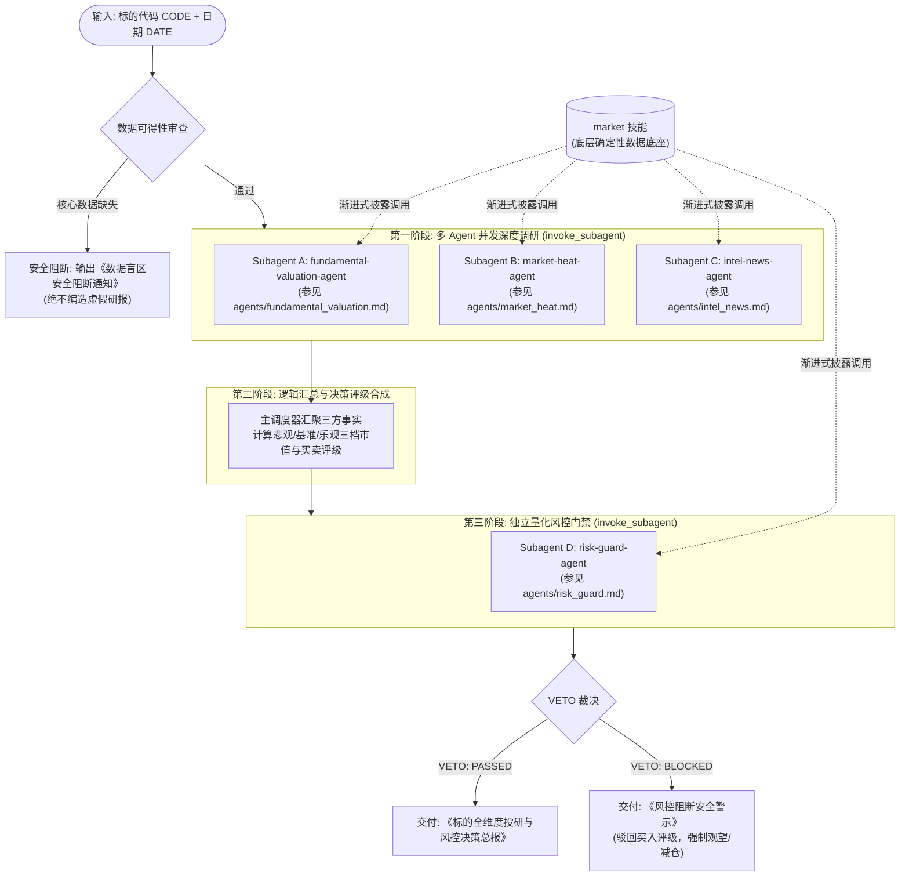

# Ticker Pipeline — 多 Agent 并行投研与风控决策流水线

本技能作为端到端的多智能体协同投研操作系统。通过并发调度多个专业 Subagent，实现从底层事实采集、基本面估值核算、筹码与机构热度透视、全网消息舆情扫描，到跨维度综合评级，最后经由独立量化风控门禁行使一票否决权（VETO Authority），输出高置信度的决策总报。

---

## 零虚构与无数据坚决不输出研报铁律（Zero-Fabrication Data Gate）

1. **真实数据绝对唯一性**：
   - 流水线中引用的所有基本面财务数据（最新 EPS、归母净利润、营收增速、净资产）、行情与技术指标（最新价、涨跌幅、均线、MACD、RSI、布林带）、筹码数据（获利盘比例、平均成本、集中度）、机构资金流（1/3/5日净流入、主力净买额、龙虎榜席位）以及宏观/外盘资讯，**必须 100% 为确定性真实数据**。
2. **渐进式披露与多级数据获取路径**：
   - **第一优先**：各专员遵照渐进式披露原则，查阅并调用本仓库 **`market`** 技能（具体命令与参数规范直接参见 [`market/SKILL.md`](../market/SKILL.md)）获取确定性数据；
   - **第二优先**：若命令遇到网络波动、港美股特定财报字段未包含或问财受限，必须通过 `search_web` / `read_url_content` / `tencent-news` / `agent-browser` 检索官方公告、交易所数据（上交所/深交所/港交所/SEC）或权威财经媒体（新华财经、彭博、路透、东方财富）。
3. **缺失即阻断（Fail-Fast）**：
   - 若通过上述所有途径均无法获取到标的的核心真实财务（EPS/净利润）或行情数据，**流水线必须立即无条件安全终止**；
   - 直接向用户输出《数据盲区安全阻断通知》，**坚决严禁编造任何虚假财务数字、脑补技术指标或输出毫无数据支撑的虚构研报**！

---

## Subagent 架构与规范索引 (Agents Index)

流水线将各专业 Subagent 的系统 Prompt 与专项分析规范独立存放于 `agents/` 目录下，便于查看、审查与独立演进：

| 专员代号 (Role) | 职能定位 | 数据源依赖 | 专属 Agent 规范文件 |
|---|---|:---:|---|
| **`fundamental-valuation-agent`** | 真实财务 EPS、5 种多模型估值、技术面四维体检 | `market` 技能 (`quote`/`financials`/`technical`) | [`agents/fundamental_valuation.md`](agents/fundamental_valuation.md) |
| **`market-heat-agent`** | 筹码分布、获利盘比重、主力资金流向、龙虎榜席位 | `market` 技能 (`chips`/`stock-flow`/`lhb`) | [`agents/market_heat.md`](agents/market_heat.md) |
| **`intel-news-agent`** | 宏观政策、行业赛道、个股重大事件公告四维打标 | `market` 技能 (`news`/`flows`/`overnight`) + 搜索 | [`agents/intel_news.md`](agents/intel_news.md) |
| **`risk-guard-agent`** | 逻辑自洽交叉核验、大势乘数、4 大红线与一票否决 | `market` 技能 (`snapshot`/`limits`/`technical`) | [`agents/risk_guard.md`](agents/risk_guard.md) |

---

## 流水线整体架构



---

## 阶段一：多 Agent 并行深度调研

主调度器必须使用单次 `invoke_subagent` 调用，同时启动 3 个专属 Subagent 进行并发分析，避免串行等待。各专员根据需求查阅并调用 `market` 技能获取数据。

### 并发调度指令规范

```python
invoke_subagent(
    Subagents=[
        {
            "TypeName": "self",
            "Role": "fundamental-valuation-agent",
            "Prompt": "<加载 agents/fundamental_valuation.md 并替换 {CODE} 和 {DATE}>"
        },
        {
            "TypeName": "self",
            "Role": "market-heat-agent",
            "Prompt": "<加载 agents/market_heat.md 并替换 {CODE} 和 {DATE}>"
        },
        {
            "TypeName": "self",
            "Role": "intel-news-agent",
            "Prompt": "<加载 agents/intel_news.md 并替换 {CODE} 和 {DATE}>"
        }
    ]
)
```

---

### Subagent A: 基本面与多模型估值专员 (`fundamental-valuation-agent`)

- **独立规范文档**：[`agents/fundamental_valuation.md`](agents/fundamental_valuation.md)
- **职责定位**：透视标的真实资产质地、盈利质量与成长性。核算真实 EPS，根据公司商业模式从 5 种估值模型（PE / PEG / PB-ROE / PS / 自由现金流折现 DCF）中选取 2~3 种最适用模型，测算【悲观 / 基准 / 乐观】三档目标市值与对应目标价，并结合 20+ 项量化技术指标进行技术面体检。
- **底层数据支持**：查阅并调用 **`market`** 技能的 `quote`、`financials`（利润表/负债表/现金流量表）与 `technical` 命令（参见 [`market/SKILL.md`](../market/SKILL.md)）。
- **输出规格**：符合 `agents/fundamental_valuation.md` 中规范的标准化 JSON 事实块。

---

### Subagent B: 市场热度与机构参与度专员 (`market-heat-agent`)

- **独立规范文档**：[`agents/market_heat.md`](agents/market_heat.md)
- **职责定位**：深度透视筹码成本结构、主力资金进出与机构博弈深度。评估当前获利盘比重、筹码单峰/多峰密集度、主力资金 1/3/5 日持续性净买卖力度，以及龙虎榜（LHB）游资与机构席位动向。
- **底层数据支持**：查阅并调用 **`market`** 技能的 `chips`、`stock-flow` 与 `lhb` 命令（参见 [`market/SKILL.md`](../market/SKILL.md)）。
- **输出规格**：符合 `agents/market_heat.md` 中规范的标准化 JSON 事实块。

---

### Subagent C: 消息舆情与市场情报专员 (`intel-news-agent`)

- **独立规范文档**：[`agents/intel_news.md`](agents/intel_news.md)
- **职责定位**：全天候扫描宏观政策风向、所处行业板块催化、标的公司自身公告（重组、增减持、业绩预告、合同中标、诉讼立案）、全网权威舆情及隔夜外盘联动。客观陈述事实，执行四维属性打标。
- **底层数据支持**：查阅并调用 **`market`** 技能的 `news`、`flows` 与 `overnight` 命令（参见 [`market/SKILL.md`](../market/SKILL.md)），按需结合外部检索工具。
- **输出规格**：符合 `agents/intel_news.md` 中规范的标准化 JSON 事实块。

---

## 阶段二：评级合成与目标价推导

主调度器汇聚 Subagent A、B、C 的三方客观事实，执行多因子加权评分（0~100 分）：
- **基本面质地与估值差（权重 35%）**：EPS 增长、ROE 水平、当前市值相对基准估值折扣率；
- **筹码结构与资金合力（权重 25%）**：筹码获利盘适中程度（30%~70% 最佳）、主力资金持续流入强度；
- **消息与政策催化度（权重 20%）**：所处赛道景气度、是否存在重大正面催化、排查无一票否决级利空；
- **技术量化趋势配合（权重 20%）**：多头均线排列、量价配合、MACD 处于红柱多头区。

### 综合得分与初始建议评级矩阵

| 综合加权得分 | 初始决策建议 | 评级含义 |
|:---:|:---:|:---|
| **85 ~ 100 分** | 🟢 **强烈推荐买入 (Strong Buy)** | 基本面扎实、估值具备安全边际、资金净流入、政策正向催化 |
| **70 ~ 84 分** | 🟡 **逢低试仓配置 (Buy on Dips)** | 核心逻辑向好，但短期存在技术阻力或筹码松动，宜分批低吸 |
| **50 ~ 69 分** | ⚪ **观望持有 (Hold / Watch)** | 逻辑平淡、估值处于合理区间上沿、无主力明显入场迹象 |
| **0 ~ 49 分** | 🔴 **减仓卖出 (Sell / Reduce)** | 基本面恶化、主力资金大幅撤离、存在重大利空或破位空头 |

---

## 阶段三：独立量化风控核验与一票否决门禁

在生成最终报告前，**必须拉起 Subagent D（量化风控专员 `risk-guard-agent`）**，对评级与分析逻辑进行全方位逆向质疑与自洽性核验，行使一票否决权（VETO Authority）。

### Subagent D: 量化风控与一票否决专员 (`risk-guard-agent`)

- **独立规范文档**：[`agents/risk_guard.md`](agents/risk_guard.md)
- **职责定位**：作为买入前的独立安全门禁。负责大势环境（Regime）标定、信号自洽性交叉核验、仓位上限计算、动态止损位锁定，以及排查 4 大一票否决红线。
- **底层数据支持**：查阅并调用 **`market`** 技能的 `snapshot`、`limits` 与 `technical` 命令（参见 [`market/SKILL.md`](../market/SKILL.md)）。
- **调度调用方式**：
  ```python
  invoke_subagent(
      Subagents=[
          {
              "TypeName": "self",
              "Role": "risk-guard-agent",
              "Prompt": "<加载 agents/risk_guard.md 并填入 {CODE}、{DATE}、{PROPOSED_RATING}、{TARGET_PRICE} 与 {SUMMARY}>"
          }
      ]
  )
  ```
- **输出规格**：符合 `agents/risk_guard.md` 中规范的标准化 JSON 风控审查报告。

---

## 阶段四：标准化输出规范

根据风控审查裁决与数据完整性状态，最终交付对应维度的标准化报告，并**统一写入用户当前工作空间的归档文件** `./report/ticker/YYYYMMDD_{CODE}_{标的名称}_投研决策总报.md`（带标准 Frontmatter，参见 [`templates/ticker_report.md`](templates/ticker_report.md)），若目录不存在则自动创建，切勿写入技能代码安装目录。

### 场景 1：风控通过交付《标的全维度投研与风控决策总报》

归档路径：`./report/ticker/YYYYMMDD_{CODE}_{标的名称}_投研决策总报.md`

```markdown
# 《标的全维度投研与风控决策总报》：[标的名称] ([标的代码])

- **评估基准日期**：YYYY-MM-DD
- **最终决策评级**：🟢 强烈推荐买入 / 🟡 逢低试仓配置 / ⚪ 观望持有 / 🔴 减仓卖出
- **风控门禁状态**：🛡️ **VETO: PASSED (风控合规已放行)**
- **建议持仓上限**：不超过账户总资产的 X%
- **动态止损价位**：XX.XX 元 (跌破即刻触发退出保护)

---

## 1. 核心投资逻辑与三档估值区间

| 估值情景 | 估值核心假设与模型 | 测算目标总市值 (亿元) | 对应目标价 (元) | 较现价上涨空间 |
|:---|:---|:---:|:---:|:---:|
| **悲观情景 (Downside)** | 行业下行周期 / PE 底部折价 | XXX | XX.XX | -XX% / +XX% |
| **基准情景 (Base)** | 业绩符合预期 / 历史中枢估值 | XXX | XX.XX | +XX% |
| **乐观情景 (Upside)** | 催化落地 / 景气溢价估值 | XXX | XX.XX | +XX% |

---

## 2. 基本面真实财务与资产质地

- **最新业绩指标**：最新扣非 EPS 为 X.XX 元，营业收入同比增长 XX.X%，归母净利润同比增长 XX.X%。
- **盈利质量与资产结构**：净资产收益率 (ROE) 为 XX.X%，资产负债率为 XX.X%，经营现金流净额 XXX 亿元。
- **商业模式与壁垒评价**：[简述核心竞争壁垒与客户集中度]。

---

## 3. 筹码博弈与机构参与度透视

- **筹码成本分布**：最新全市场获利盘比例为 XX.X%，全市场平均持股成本为 XX.XX 元。70% 筹码集中度为 XX.X%，呈现 [单峰密集/低位发散] 格局。
- **机构资金动向**：近 5 个交易日主力资金净流入 XXX 万元（占总成交额 XX.X%）。超大单净流入趋势为 [持续吸筹 / 高位派发]。
- **龙虎榜与异动席位**：[机构席位与游资席位博弈情况，若无则注明无异动上榜]。

---

## 4. 全网舆情、公告与行业催化客观事实

- **宏观与外盘截面**：[隔夜美股/A50表现及汇率动态]。
- **所处行业景气度**：[行业板块资金流向排名及主线地位]。
- **标的重大事项**：
  - [YYYY-MM-DD] [🔴高/🟡中/🔵低] [正面/负面] [具体事实陈述，注明官方来源]。

---

## 5. 量化技术指标四维体检

- **趋势形态**：MA5/10/20 排列状态，当前价格站稳/跌破关键均线。
- **动量震荡**：MACD DIF=X.XX, DEA=X.XX, 柱状图状态；RSI_6=XX.X (处于中性/超买/超卖区)。
- **通道与波动**：布林带开口方向，当前价格所处通道位置；近 10 日真实波幅 ATR=X.XX 元。

---

## 6. 独立风控审计日志 (Risk Guard Audit)

- **当前大势环境 (Regime)**：[牛市/结构性/震荡/熊市退潮]，大势仓位乘数核准为 X.X。
- **信号自洽性交叉核验**：
  - 主观逻辑与均线/动量是否一致：[✅ 自洽 / ❌ 存在矛盾已修正]
  - 估值空间与安全边际是否达标：[✅ 合格 / ❌ 不足]
- **动态止损与风控纪律**：若收盘价跌破 XX.XX 元或单日回撤超过 X%，无条件执行纪律止损。
```

---

### 场景 2：风控否决交付《风控阻断安全警示》

```markdown
# 🚨《风控阻断安全警示》：[标的名称] ([标的代码])

- **评估基准日期**：YYYY-MM-DD
- **风控门禁状态**：🚫 **VETO: BLOCKED (一票否决门禁已触发)**
- **原始提议评级**：[原评级，如 🟢 强烈推荐买入]
- **强制修正评级**：⚪ **观望持有** 或 🔴 **减仓卖出**
- **建议持仓上限**：**0% (严禁开仓买入)**

---

## 1. 触发风控一票否决核心红线

1. **[红线名称，如：信号严重背离 / 趋势逻辑矛盾]**：
   - 原始分析认为当前处于逢低买入阶段，但量化指令检测到均线呈现坚决空头排列（MA5 < MA10 < MA20），且 MACD 零轴下死叉发散，属于典型的逆势猜底行为。
2. **[红线名称，如：短线极度超买耗尽]**：
   - RSI_6 达到 XX.X（超过 85 极限阈值），筹码获利盘达到 XX.X%，成交量急剧萎缩出现量价背离，追高盈亏比严重失衡。
3. **[红线名称，如：大势极度恶劣]**：
   - 全市场处于熊市极端退潮期，全市场上涨家数不足 20%，系统性系统风险高企。

---

## 2. 纪律性操作指令
- 立即终止买入操作；
- 已有持仓者应遵照动态止损线 [XX.XX 元] 做好防守准备；
- 保持空仓观望，等待量化指标修复与风控放行信号。
```

---

### 场景 3：关键数据缺失交付《数据盲区安全阻断通知》

```markdown
# ⚠️【数据盲区安全阻断通知】

- **标的代码**：[标的代码]
- **查询日期**：YYYY-MM-DD
- **阻断状态**：🛑 **PIPELINE SAFE HALTED (流水线完全终止)**

---

## 阻断原因说明
流水线在第一阶段数据采集过程中，尝试通过以下全部权威渠道均无法获取到标的的核心真实数据：
1. 本地数据引擎：调用 `market` 技能相关数据命令未返回有效财报或行情数值；
2. 权威网络检索：官方交易所公告与主流财经终端未检索到经过审计的最新关键 EPS/营收数据。

---

## 零虚构合规声明
> **MMTickerLab 恪守零虚构铁律（Zero-Fabrication Data Gate）**：
> 拒绝在数据盲区做任何主观臆测，坚决严禁凭空捏造财务数字、技术指标或伪造估值报告。本流水线已安全终止，不生成任何虚假研报以捍卫投研决策的严肃性。
```
